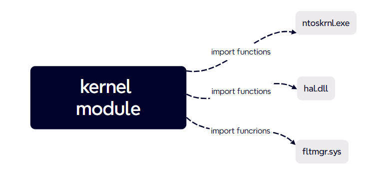
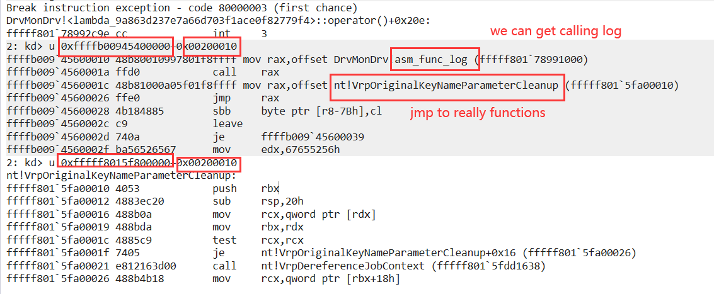
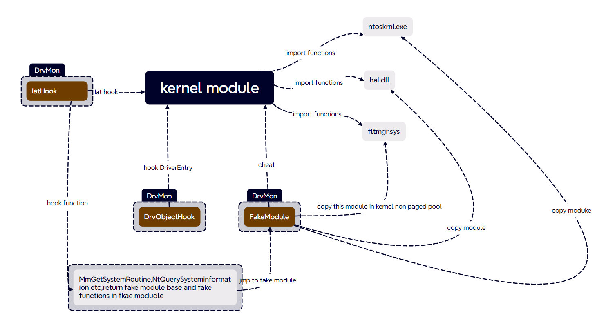
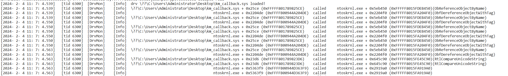
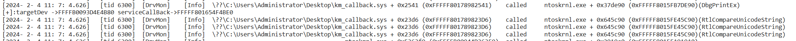
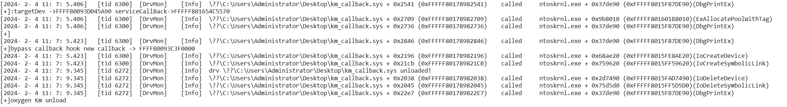
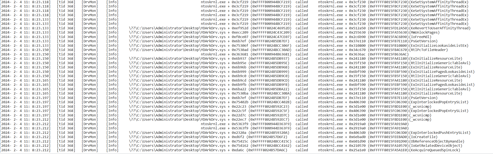
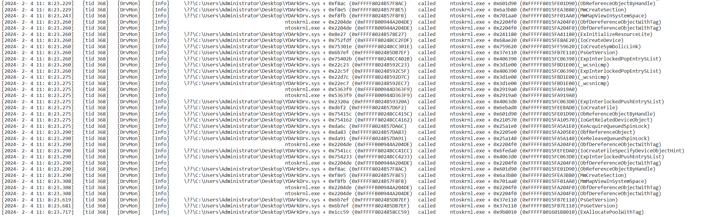

# DrvMon

- DrvMon是一个轻量级工具，用于监控驱动程序对系统内核API的调用。DrvMon具有以下功能：
  1. 加载DrvMon驱动程序后，默认情况下，驱动程序将监控所有对ntoskrnl.exe、hal.dll和fltmgr.sys模块的调用信息（函数名、调用者地址、被调用者地址、调用时间、调用线程ID等）。
  2. 用户可以自定义要监控的其他模块，如win32k.sys等。
  3. 记录跨模块API调用,dbgview可以接受到这些信息，同时会将一份记录保存到C:\log.txt。
  4. 不仅可以监控普通驱动程序，还可以监控具有加了壳的程序（如vmp）并隐藏IAT的驱动程序。
  5. 尽管原理部分依赖于IAT钩子，但DrvMon仍然可以记录驱动程序从内核模块调用非导出函数的信息，由于不依赖于任何pdb解析，因此无法解析函数名(如果导出,可以解析)。

## method

DrvMon通过内核模块重载+IAT钩子来欺骗驱动程序实现。**具体实现细节如下**：

1. 通常情况下，当一个驱动程序被加载到内核时，Windows内核模块加载器会根据该模块的IAT项动态填充函数的真实地址。

2. 传统的IAT钩子只能钩住固定的函数，不同的函数需要不同的处理。此外，它还很容易检测到，例如，我可以通过各种方法获取真实的内核模块基址，手动解析它的导出表，或者直接调用NtQuerySysxx获取模块基址，MmGetSystemRoutine获取函数等等。

3. DrvMon使用IAT钩子+内核模块重载来欺骗驱动程序，给它一个假的基地址方法。首先，DrvMon将内核模块复制到非分页内存，然后遍历这个假模块的所有函数开头，使用硬编码jmp到真实模块的函数开头。

4. 然后，对某些可能获取模块基址的函数以及内核函数（如MmGetSystemRoutine），进行IAT钩子处理，并进行特殊处理。DrvMon维护一个假的PsLoadedModuleList，并修改驱动程序的Ldr（DriverObject->DriverSection），以防止驱动程序从这个位置获取真实模块的基址。
5. 完成这些步骤后（仍有许多函数未处理），每次驱动程序调用任何函数时，无论是从IAT还是手动解析，理论上都应该被钩住。

因此，为了欺骗驱动程序，需要对某些可能获取模块基址的函数以及内核函数进行特殊处理。在这里，我已经处理了：

> MmGetSystemRoutineAddress
> NtQuerySystemInformation
> ZwQuerySystemInformation
> RtlPcToFileHeader

当然,有许多函数可以实现上述效果，还需要处理更多的函数。

## demonstration

- **没加壳的普通驱动**

- **加了vmp壳并使用vmp的iat保护**

- **YDARK自带的驱动(加了不知道什么版本的vmp壳)**

https://github.com/ClownQq/YDArk

## License

本项目的发布遵循MIT许可证

## Warning & Caveats

- DrvMon旨在作为一个教育工具，并不健壮。无论原理如何，DrvMon始终是一个激进且实验性的项目。我仍有许多函数没有处理或钩住。使用过程中出现蓝屏是很正常的**(其实是太菜,有两个蓝屏可以复现,但是没能解决)。**
- **BSOD!!!**:
- 已经出现了两个偶发的蓝屏（实际上第二个蓝屏可以复现，但目前无法解决）：
  1. 在getModuleNameByPtr函数中，info这个局部变量的指针指针莫名其妙会被破坏，尽管前面我已经判断指针的有效性了，所以猜测是栈被破坏了，但是10次有一次复现，没有精力继续解决(菜)。
  2. 在监控ydark.sys时，监控大约30秒左右，线程的RIP会跑到0xffff800010000000这个地址。我怀疑有些函数可能还是没有处理好。

## Supported Platforms

- 以上x64 Windows 10

## Contribute

欢迎提交PR，谢谢！

## Todo

- [x] Overall framework
- [x] Hook necessary functions
- [x] Make log recording time more user-friendly
- [ ] hook额外的函数
- [ ] 栈回溯
- [ ] ~~R3 program PDB re-parsing~~
- [ ] 处理.data区域(主要是同步)
- [ ] 解决能复现的0x50蓝屏

