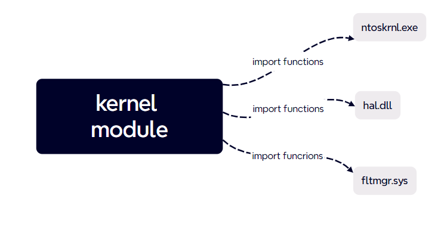
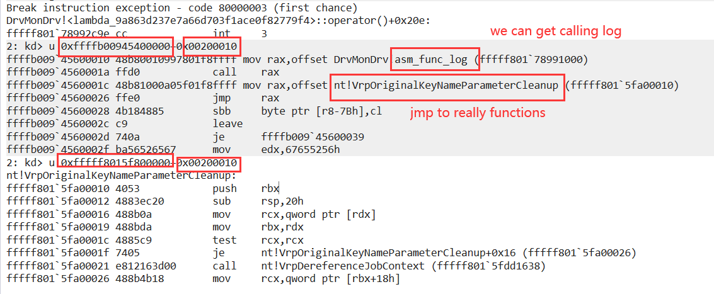
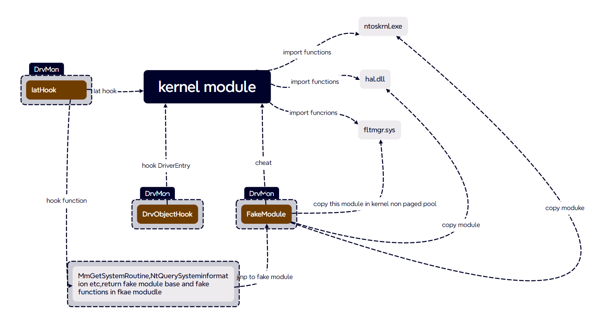
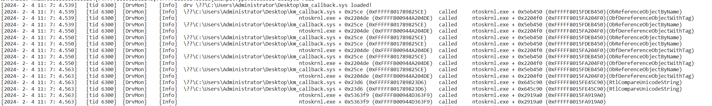
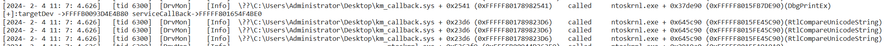
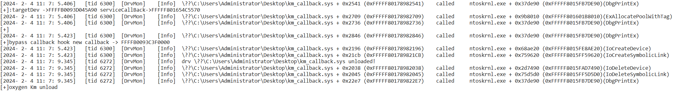
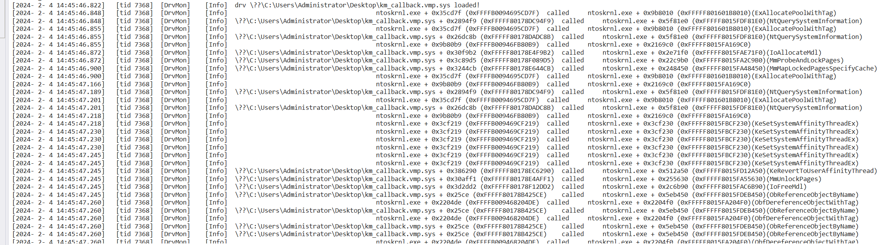
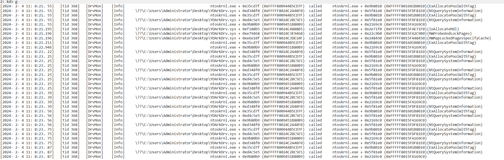
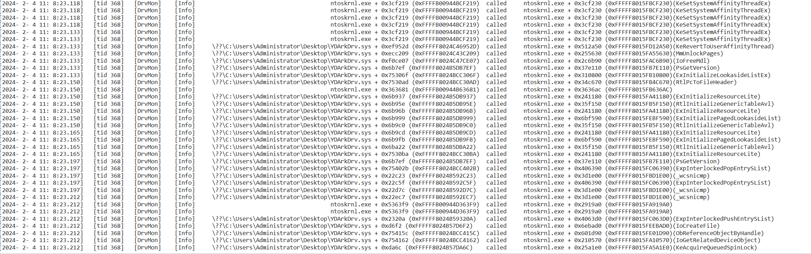
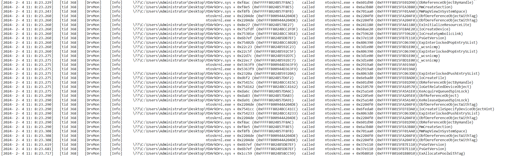

# DrvMon

[简体中文](readme-cn.md)

DrvMov is a lightweight tool that monitors driver calls to the system kernel API.

DrvMov offers some following features:

- After loading the DrvMon driver, the driver will monitor the calling infomation(function names,caller address,called address,called time,called tid etc...) of all driver calls to ntoskrnl.exe, hal.dll, and fltmgr.sys modules by default.
- Users can customize additional monitoring modules, such as win32k.sys, etc.
- The recorded cross-module api calls,and these infomation can be received by dbgview, and also a copy will be recorded to C:\log.txt
- Not only non-packed drivers, but also drivers with packed(likes vm protect) that hide iat can still be monitored.
- Although the principle is partly iathook, DrvMon can still record the driver calling non-exported functions from kernel modules, but because it does not rely on any pdb parse, so the function name cannot be parsed.

## method

DrvMon deceives the driver implementation through kernel module reloading + iathook。

**Its implementation details are as follows:**

Under normal circumstances, when a driver is loaded into the kernel, Windows kermodule nel loader will dynamically fill in the real address of the function based on the iat items of this module.

A conventional IAT hook can only hook fixed functions, and different processing is required for different functions. In addition, it is easy to detect, for example, I can obtain the real kernel module base address through various methods, manually parse its export table, or directly call NtQuerySysxx to obtain the module base address, MmGetSystemRoutine to obtain functions, and so on.
DrvMon uses an IAT hook + kernel module reload to deceive the driver and give it a fake base address method.

First, DrvMon copies the kernel module to non-paged memory, then traverses all function beginnings of this fake module, and uses a hardcode jmp to the beginning of the real module's function.

Then, IAT hook is performed on certain functions that may obtain the module's base address, as well as kernel functions (such as MmGetSystemRoutine), and special processing is performed. DrvMon maintains a fake PsLoadedModuleList and modifies the driver's Ldr (DriverObject->DriverSection) to prevent the driver from obtaining the base address of the real module from this location.
After completing these steps (and there are still many functions that have not been processed), every time the driver calls any function, whether from the iat or by manually parsing, it should theoretically be hooked.

Therefore, special processing is necessary for certain functions that may obtain the module's base address, as well as kernel functions, in order to deceive the driver. Here, I have processed:

1. MmGetSystemRoutineAddress

2. NtQuerySystemInformation

3. ZwQuerySystemInformation

4. RtlPcToFileHeader

   However, there are still many functions that can achieve the above effect, and we need to process more.

## demonstration

- **normal driver(without any packed) test**

- **packed by vmprotect driver test**

- **ydark.sys(An closed-source Windows Ark tool comes with a driver that has an unknown version of VMP protection)**

https://github.com/ClownQq/YDArk

## License

This project is released under the **MIT License**

## Warning & Caveats

- DrvMon is meant to be an educational tool and not robust,regardless of the principle, DrvMon is always a radical and experimental project. I still have too many functions that I have not processed or hook. It is even normal for a bsod appearing during use.
- **BSOD!!!**:There have been two sporadic bsod (actually the second blue screen can be reproduced, but it cannot be solved at present):
  1. In the `getModuleNameByPtr` function, the pointer to the info local variable is inexplicably destroyed, even though I have already checked the validity of the pointer earlier. Therefore, I suspect that the stack is damaged, but it only happens once every 10 times, and I do not have the energy to continue solving it.
  2. When monitoring `ydark.sys`, after about 30 seconds of monitoring, the thread's RIP will jump to the address 0xffff800010000000. I suspect that some functions may still not be handled properly.

## Supported Platforms

- above x64 windows 10

## Contribute

welcome to pr,thanks!

## Todo

- [x] Overall framework
- [x] Hook necessary functions
- [x] Make log recording time more user-friendly
- [ ] Hook additional functions
- [ ] Stack trace
- [ ] ~~R3 program PDB re-parsing~~
- [ ] Process data area
- [ ] Handle 0x50 PAGE_FAULT_IN_NO_PAGE_AREA blue screen (temporarily no clue, stable reproduction with YDARK, but cannot be solved)

